<p align="center">
  
</p>

<h1 align="center">HyRoute</h1>

<p align="center">
  Клиент Hysteria 2 для Windows с раздельной маршрутизацией.<br>
  Что идёт через VPN, что напрямую, а что блокируется — по программе, по сайту, по IP или по готовым спискам.
</p>

<p align="center">
  <a href="https://github.com/lardan099/HyRoute/releases/latest"></a>
  
  <a href="LICENSE"></a>
</p>

<p align="center">
  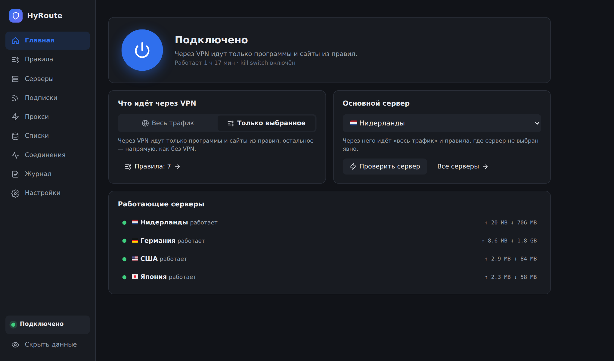
</p>

Программы не нужно настраивать на прокси. HyRoute перехватывает их соединения драйвером WinDivert и разводит по правилам, а до серверов ходит через официальный `hysteria.exe`. YouTube может идти через Германию, ChatGPT через США, Discord через основной сервер, а банки и Госуслуги напрямую — одновременно.

## Возможности

- **Пошаговая настройка** при первом запуске и простой режим с подсказками. Все страницы и тонкие настройки — в режиме «Для опытных».
- **Правила** по программам, сайтам, IP, портам и спискам geosite/geoip, каждое на свой сервер. Правило можно сделать прямо из списка соединений.
- **Профили правил**: несколько наборов правил («Дом», «Работа», «Игры») и переключение между ними на главной, на странице «Правила» и в меню значка в трее.
- **Запасные серверы**: если сервер правила недоступен, соединения идут через следующий, а если лежат все — блокируются, напрямую не уходят.
- **Группы серверов**: HyRoute сам выбирает сервер для новых соединений — самый быстрый, первый работающий, по кругу, случайно или один и тот же для сайта.
- **Несколько серверов одновременно** и серверы из подписок с автообновлением. Остаток трафика и срок подписки видны на странице «Подписки», а когда они подходят к концу, предупредит главная.
- **Локальные прокси** SOCKS5 (с UDP) и HTTP для программ, у которых есть настройка прокси.
- **DNS по правилам**: имена сайтов, которые идут через VPN, разрешаются через тот же сервер, заблокированные не разрешаются вовсе; свой DoH/DoT для остальных и защита от DoH браузеров.
- **Статистика**: сколько трафика прошло через VPN — по программам, сайтам и серверам, за день, неделю и месяц.
- **Резервная копия** серверов, подписок и правил в один файл с паролем — для переноса на другой компьютер (группы, другие профили правил, правила сетей и DNS в неё пока не входят).
- **Kill switch**: если HyRoute упал или его закрыли, интернет закрыт, пока вы снова не подключитесь.
- **Трей, запуск вместе с Windows** и автоподключение.
- **Сети**: дома по Wi-Fi — напрямую, в незнакомой сети — через VPN, в офисе — свой профиль правил.
- **Командная строка** `hyroutectl` для скриптов: состояние, подключение, основной сервер, профиль правил, «Проверить адрес», импорт и экспорт правил, правила сетей, статистика; по умолчанию только просмотр.
- **Обновления** себя и ядра Hysteria с откатом, если новая версия не заработала.

## Установка

Нужны Windows 10 или 11 (64-бит), права администратора и сервер Hysteria 2.

1. Скачайте `HyRoute-<версия>-windows-amd64.zip` со страницы [Releases](https://github.com/lardan099/HyRoute/releases/latest) и распакуйте.
2. Запустите `HyRoute.exe` и разрешите запуск от администратора: без этих прав драйвер перехвата не загрузится.
3. На главной нажмите «Перенести»: HyRoute скопирует себя в `C:\Program Files\HyRoute` и добавит ярлык в «Пуск». Там обычные программы не могут подменить его файлы, а автозапуск работает только оттуда.

`hysteria.exe` и WinDivert лежат в архиве. Если их нет, HyRoute скачает их сам и сверит с контрольными суммами.

## Быстрый старт

При первом запуске HyRoute сам проведёт по шагам: добавит сервер или подписку, проверит его, спросит, что пускать через VPN, и включит. [Как это устроено](docs/GUIDE.md#простой-режим-и-пошаговая-настройка).

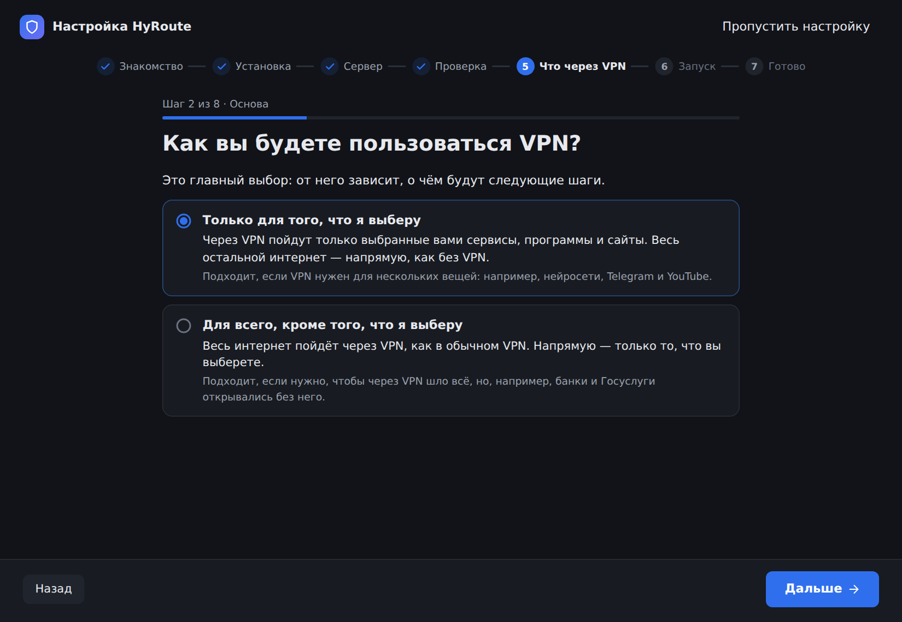

Вручную то же самое:

1. **Серверы** → вставьте ссылку `hysteria2://…` или нажмите «Из буфера обмена». Подписку добавьте на странице «Подписки».
2. **Правила** → «Шаблоны» → выберите схему:
   - «Через VPN только заблокированное» — заблокированное в России через VPN, остальное напрямую;
   - «Всё через VPN, кроме российского» — российские сайты, банки и Госуслуги напрямую, остальное через VPN.
3. **Главная** → кнопка включения.

Если сайт идёт не туда, откройте «Правила» → «Проверить адрес»: HyRoute покажет, какое правило сработало и почему.

## Как это устроено

Все подробности — в [руководстве](docs/GUIDE.md).

### Правила

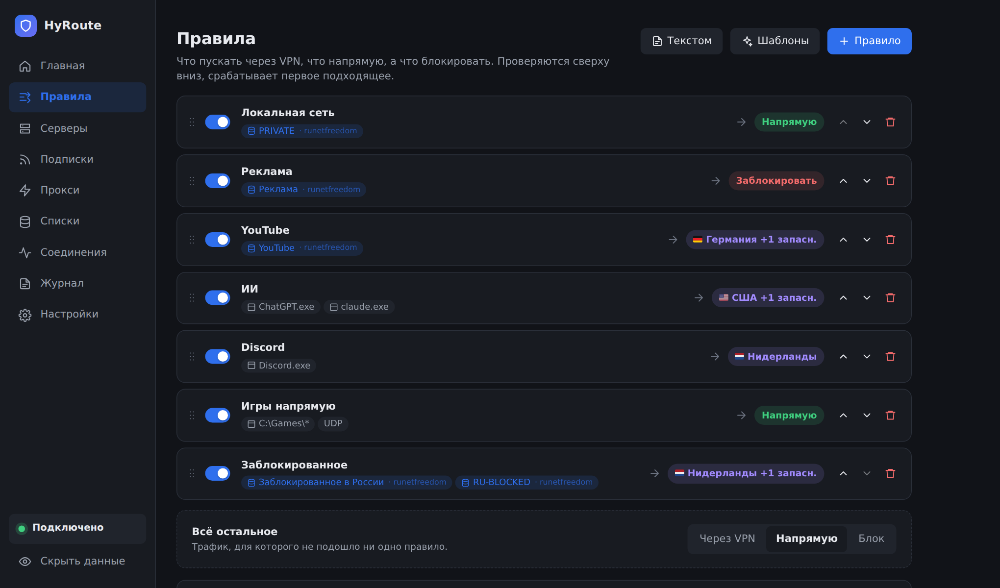

Кнопка «Пошагово» собирает правила по шагам с объяснениями: сервисы, программы, сайты, блокировка, серверы. Правила проверяются сверху вниз, срабатывает первое подходящее. Всё, что не подошло ни под одно, идёт по строке «Всё остальное». Правила перетаскиваются мышью и выключаются переключателем.

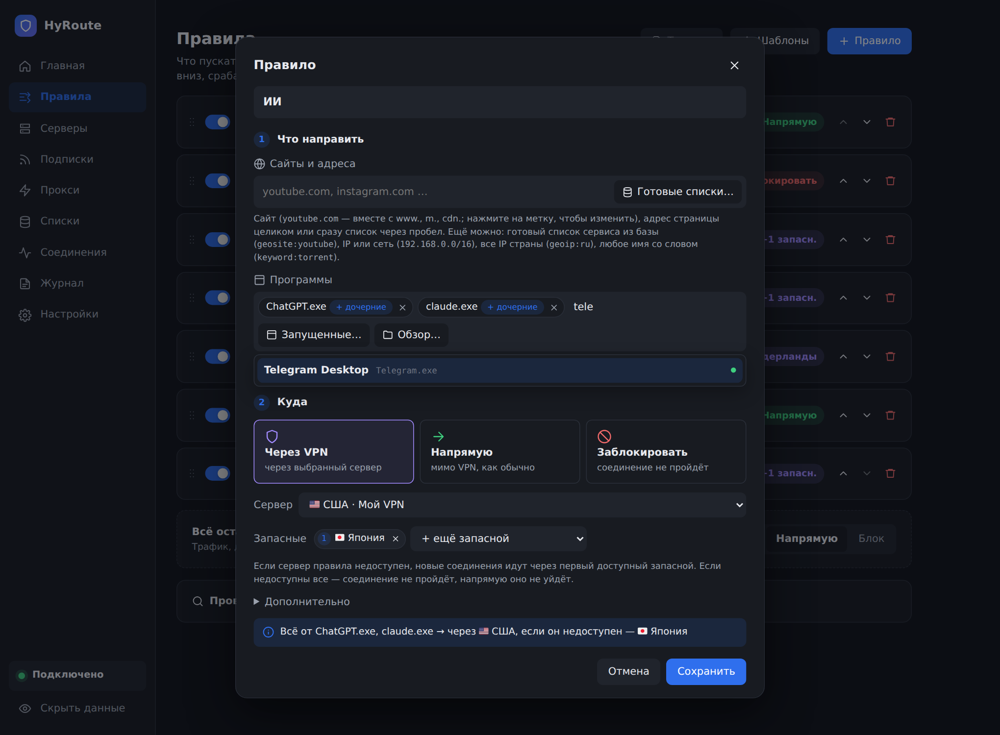

В правиле задаётся, что направлять и куда:

- **Программы.** Начните вводить часть имени — HyRoute подскажет подходящие из запущенных. Правило действует и на процессы, которые программа запускает (лаунчер и игра, браузер и его вкладки).
- **Сайты и адреса.** Домен, IP, сеть или готовый список (`geosite:youtube`, `geoip:ru`). Домен HyRoute узнаёт из DNS, SNI и заголовка Host, поэтому правило на `youtube.com` работает и в браузере, и в приложении.
- **Протокол и порты** (необязательно): `22`, `80, 443` или `27000-27200`, с протоколом TCP или UDP. SSH через один сервер, игра на своих портах через другой; «TCP 22 → напрямую» — правило только по порту.
- **Куда:** основной сервер, выбранный сервер, напрямую или блок. У «через VPN» можно добавить запасные серверы: если сервер правила недоступен, соединения идут через следующий, а если лежат все — не проходят, напрямую не уходят.

### Правила текстом

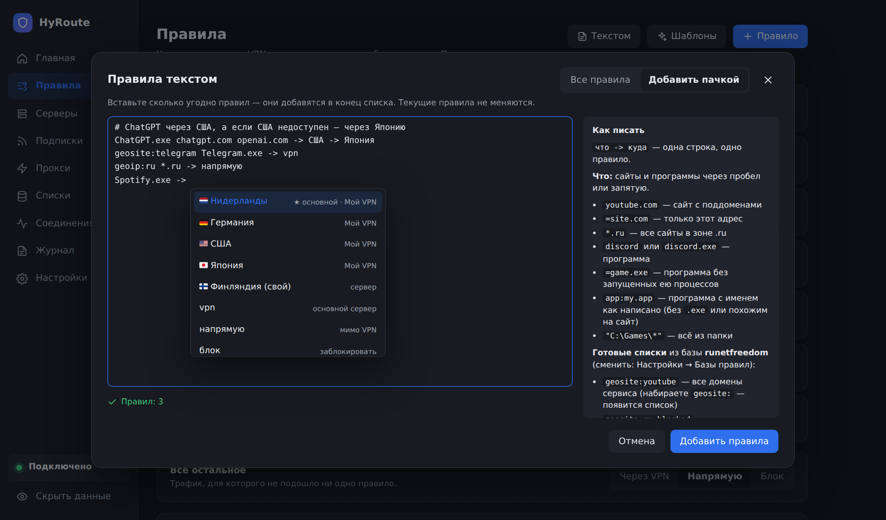

Весь список одним текстом или много правил сразу, одно на строку. Редактор подсказывает серверы, списки и имена запущенных программ. [Полный синтаксис](docs/GUIDE.md#правила-текстом).

```
# что -> куда
Локальная сеть: geoip:private -> напрямую
Заблокированное: geosite:ru-blocked geoip:ru-blocked -> vpn
YouTube: geosite:youtube -> Германия -> Нидерланды
ChatGPT.exe chatgpt.com -> США -> Япония
Реклама: geosite:category-ads-all -> блок
ssh.exe -> Германия | tcp 22
game.exe -> Нидерланды | udp 27000-27200
* -> напрямую
```

### Серверы и подписки

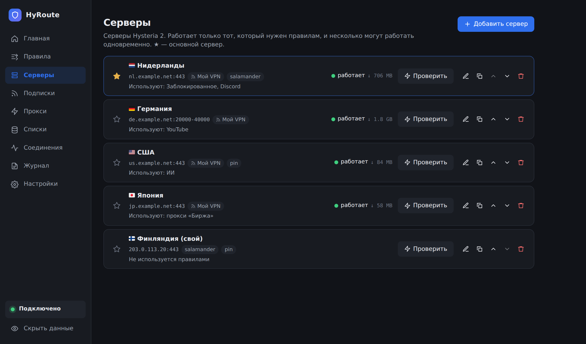

Серверы добавляются ссылками `hysteria2://` и `hy2://`, по одной или пачкой, или вручную: obfs salamander, закрепление сертификата, порт-хоппинг. HyRoute запускает только те серверы, которые нужны правилам и прокси, и перезапускает упавшие. «Проверить» показывает подключение, внешний IP, задержку и работу UDP. Основной сервер отмечен звёздочкой.

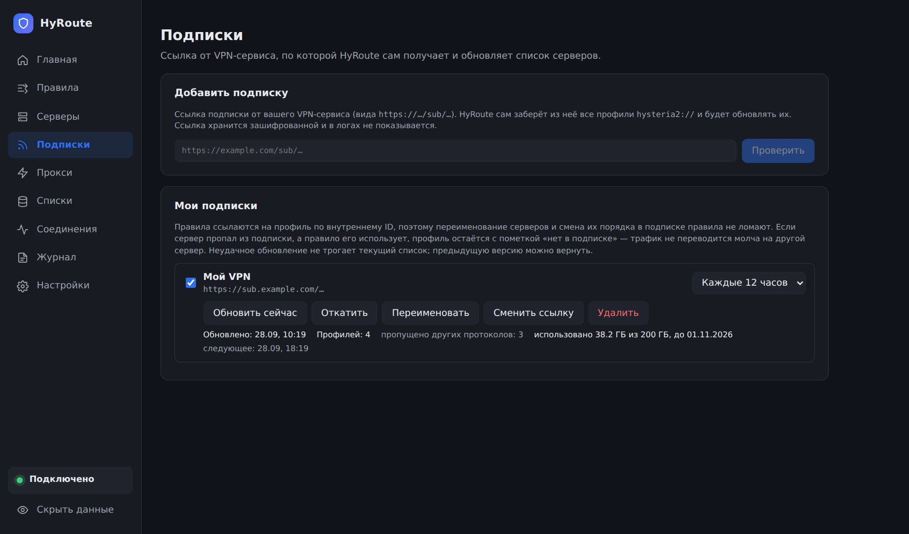

Подписка обновляется по расписанию, каждое обновление можно откатить. Серверы других протоколов (VLESS, VMess и т. д.) пропускаются. Если сервер исчез из подписки, а правило на него ссылается, HyRoute пометит его и попросит выбрать замену.

### Локальные прокси

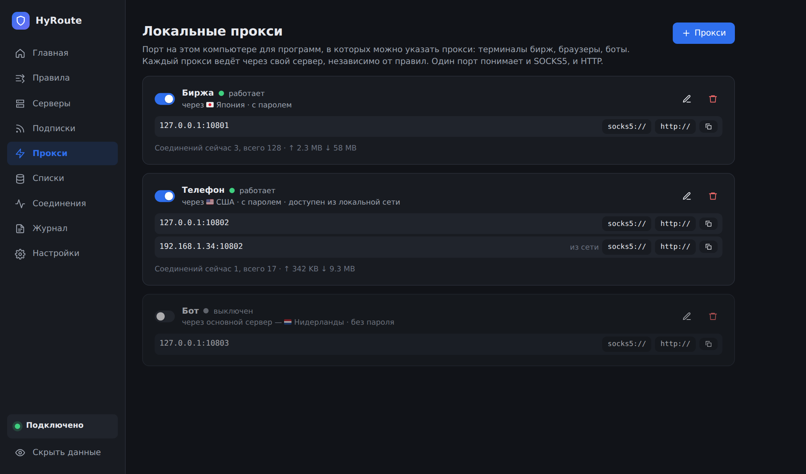

Порт на этом компьютере для программ с настройкой прокси: терминалов бирж, браузеров, ботов. Каждый прокси ведёт через свой сервер независимо от правил. Один порт принимает и SOCKS5 (вместе с UDP), и HTTP, логин и пароль по желанию. Доступ из локальной сети — только с паролем, UDP для него включается отдельно.

### Готовые списки

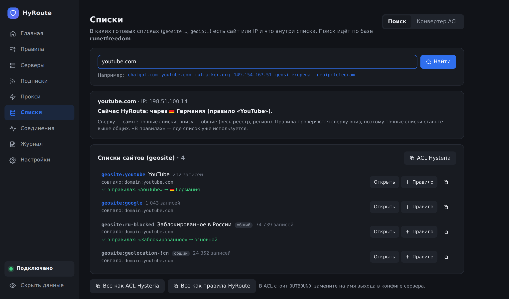

`geosite:…` и `geoip:…` берутся из тех же баз, что в v2rayN и Xray: runetfreedom (по умолчанию, с `ru-blocked`), Loyalsoldier, v2fly, hysteria-geodata или свои ссылки. HyRoute скачивает их, только когда они нужны правилам, и обновляет раз в 12 часов. Страница «Списки» отвечает, в каких списках есть сайт или IP и что HyRoute с ним делает сейчас; «Конвертер ACL» переводит ACL сервера Hysteria в правила.

### Соединения

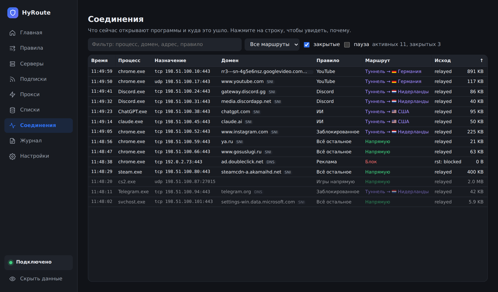

Какая программа куда подключилась, по какому правилу и через какой сервер. Щелчок по строке объясняет, почему соединение пошло именно так, а «Создать правило…» (или правая кнопка) делает правило для этой программы, сайта, списка, адреса или порта.

### Kill switch

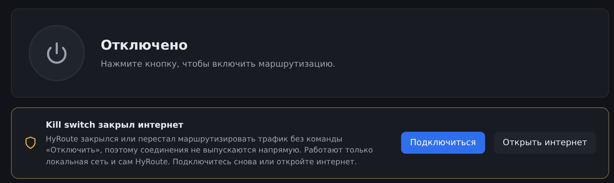

Если HyRoute закрылся во время подключения (окно закрыто, «Снять задачу», сбой) или отказал драйвер перехвата, Windows закрывает интернет, пока вы снова не подключитесь или не нажмёте «Открыть интернет». Если отказал движок, HyRoute переподключается сам. Если блокировка осталась после выключения ПК, HyRoute сам покажет её при входе в Windows. [Подробнее](docs/GUIDE.md#kill-switch).

### Запуск и трей

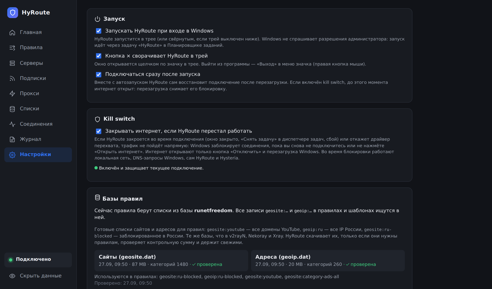

- **Запуск при входе в Windows** — без запроса прав администратора, у каждого пользователя свой.
- **Крестик сворачивает в трей.** Щелчок по значку открывает окно, правая кнопка — меню с подключением и выходом. Значок цветной, когда HyRoute подключён.
- **Подключаться сразу после запуска** — вместе с автозапуском возвращает подключение, kill switch и прокси после перезагрузки.

Ещё: журнал без паролей, диагностика, режим «Скрыть данные» для скриншотов, темы.

## Ограничения

- Без «DNS по правилам» DNS-запросы Windows идут напрямую; зашифрованный DNS самой Windows (DoH/DoT в параметрах сети) HyRoute не видит.
- Если браузер использует свой DoH и сайт скрывает имя через ECH, домен неизвестен: срабатывают правила по IP, по программе или «Всё остальное». Помогают «Не давать браузерам обходить DNS» и «Отключать ECH».
- При подключении уже открытые соединения программ и адресов, которые по правилам идут через VPN, один раз сбрасываются и открываются заново через туннель. Домены уже открытых соединений HyRoute не знает: соединение с сайтом из правила «через VPN», когда «Всё остальное» идёт напрямую, продолжает идти напрямую, пока программа не переподключится.
- UDP-датаграммы больше примерно 4 КБ (предел самой Hysteria) через VPN не проходят. Датаграммы, разбитые на IP-фрагменты, HyRoute собирает и отправляет через VPN целиком.
- Программа не подписана сертификатом разработчика: SmartScreen может предупредить при первом запуске.
- Античиты Vanguard и FACEIT (иногда EAC) не пускают в игру, пока загружен WinDivert. Часть антивирусов блокирует WinDivert.
- Поддерживается только Hysteria 2.

Полный список — в [руководстве](docs/GUIDE.md#ограничения), там же [где лежат данные](docs/GUIDE.md#где-лежат-данные) и [как удалить HyRoute](docs/GUIDE.md#удаление).

## Сборка

Нужны Go 1.27 и PowerShell. Node.js нужен только для изменений в интерфейсе: собранный интерфейс лежит в репозитории.

```powershell
.\scripts\build.ps1            # -Frontend, чтобы пересобрать интерфейс; собирает и hyroutectl.exe
.\bin\HyRoute.exe
.\bin\hyroutectl.exe --help
```

Тесты: `go test ./...`, работают и на Linux. Устройство программы описано в [`docs/ARCHITECTURE.md`](docs/ARCHITECTURE.md).

## Лицензия

[MIT](LICENSE). Сторонние компоненты и их лицензии перечислены в [`THIRD-PARTY-NOTICES.txt`](THIRD-PARTY-NOTICES.txt).
